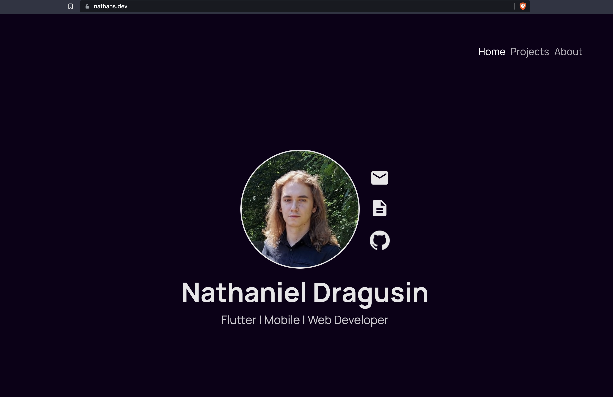

# Personal Website

 

My own personal website served at https://nathans.dev

## Quick docs

It features 3 pages:
- Landing
- Projects 
- About

The *home* folder features the bar, responsive screen mechanism and animates switching between pages.

The background is slowly shifting colours from black to dark blue.
